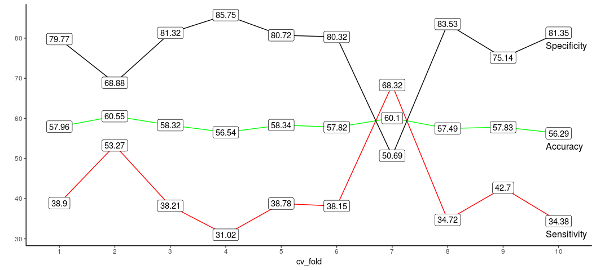
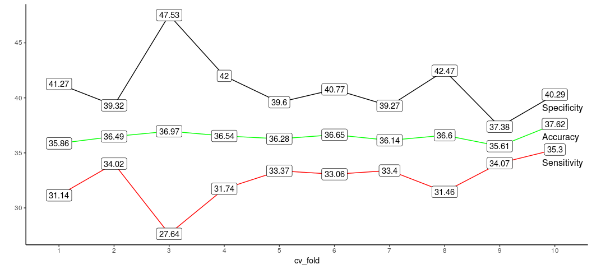
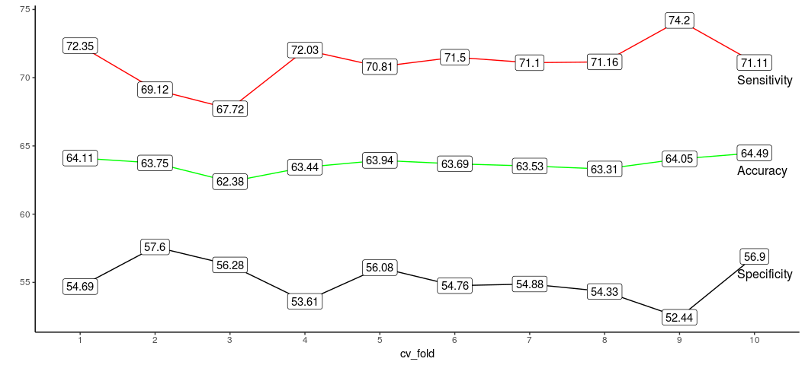
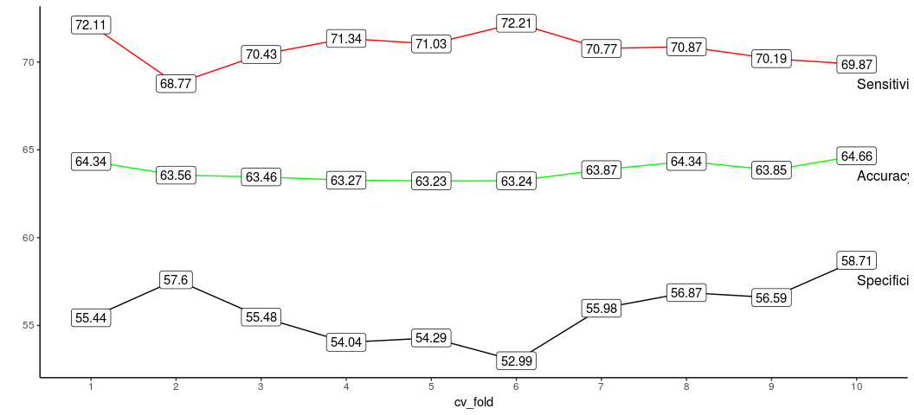
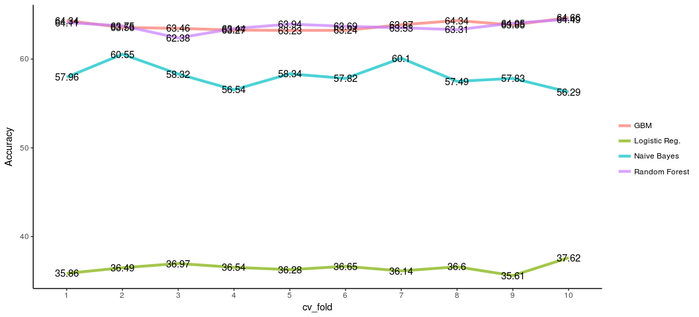
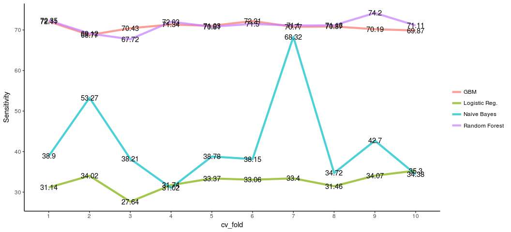
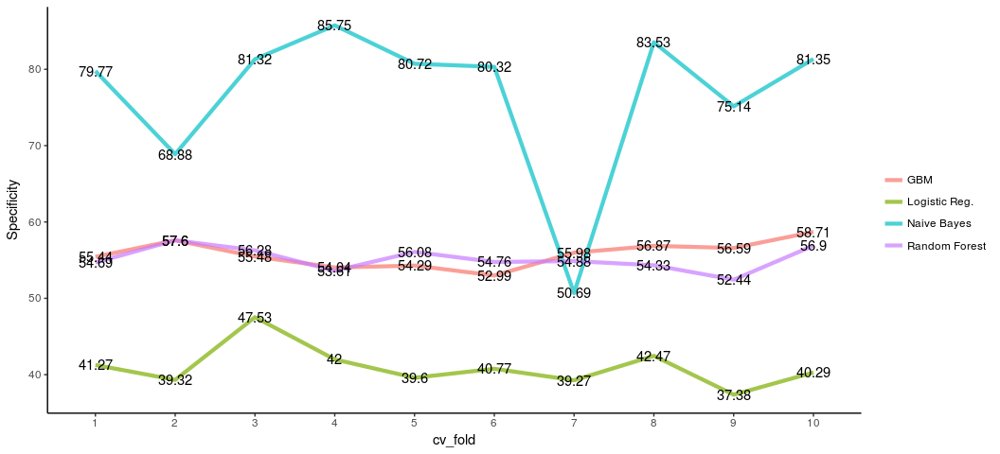
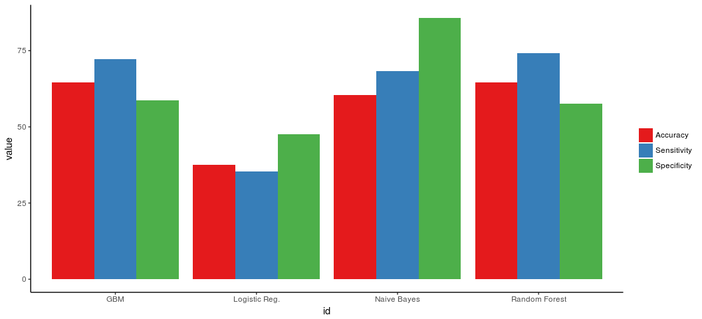

Predicting Online News Popularity
================

<br>

In this post, I will try to compare some of the widely used ML algorithms by building classification models on the Online News Popularity dataset which is available at UCI Machine Learning Repository (http://archive.ics.uci.edu/ml/datasets/Online+News+Popularity). I will be using R here and let's start by loading all the packages/libraries needed for this analysis.

If you wish even you can reproduce this analysis, just download the data (OnlineNewsPopularity.csv) into your working directory and run the following code chunks. 

``` r
library(data.table)
library(dplyr)
library(caret)
library(e1071) # used for Naive Bayes model
library(ggplot2)
library(directlabels) # for ploting purpose
library(parallelMap)
library(parallel)
library(blogdown)
```

<br>

The data consists of details of online news articles, published by Mashable, with 58 predictors and 1 target variable. The target variable is called 'shares', the number of times an online news has been shared in social media. The target variable is a continuous variable and in order to do classification I have converted it into a new variable of 2 levels based on a threshold value (median of 'shares').

``` r
mydata = fread("OnlineNewsPopularity.csv") # reading the data
mean(mydata$shares) # 3395.38
```

    ## [1] 3395.38

``` r
median(mydata$shares) # 1400
```

    ## [1] 1400

``` r
# creating the new target variable called 'category'
mydata[, category := ifelse(shares < 1400, "ordinary", "interesting")] 

# deleting the 'shares' variable as it is not needed anymore
mydata[, shares := NULL]
```

<br>

Now the data will be divided into 3 parts, training, validation, and testing. Validation dataset will be used for cross-validation. The model trained on the training dataset will be used to predict the target variable in the testing dataset.

``` r
### Data Preparation ###

# deleting the 'shares' variable as it is not needed anymore
mydata[, shares := NULL]

# dividing data in 3 datasets, 'training', 'testing', and 'validation'

set.seed(123)
idx = createDataPartition(mydata$category, p = 0.7, list = F)
train = mydata[idx]
testing = mydata[-idx]

set.seed(124)
idx2 = createDataPartition(train$category, p = 0.5, list = F)
training = train[idx2]
validation = train[-idx2]

rm(train) # deleting train dataset

set.seed(11)
folds = createFolds(validation$category, returnTrain = T)

sensitivity = list()
specificity = list()
accuracy = list()
```

<br>

Now it's time to start building our models. Let's start with the Naïve Bayes (NB) algorithm, it is quite fast and easy to apply. Here I will first do a 10-fold cross-validation (CV) and record senstivity, specificity, and accuracy for every fold. Let me remind you, the validation dataset will be used in the cross-validtion.

``` r
for(i in 1:10){
  
  trainset = validation[-folds[[i]]]
  testset = validation[folds[[i]]]
  
  set.seed(12)
  model = naiveBayes(factor(category) ~., data = trainset[,-c(1,2), with = F])
  
  pred = predict(model, testset[,-c(1,2,61),with=F])
  
  sensitivity[[i]] = confusionMatrix(pred, testset$category)$byClass[1]
  specificity[[i]] = confusionMatrix(pred, testset$category)$byClass[2]
  accuracy[[i]] = confusionMatrix(pred, testset$category)$overall[1]
  
}

# storing essential metrics from the 10-fold CV in a data frame
nb_metrics = data.frame(cv_fold = factor(1:10),
                        Accuracy = round(100*unlist(accuracy),2), 
                        Sensitivity = round(100*unlist(sensitivity),2),
                        Specificity = round(100*unlist(specificity),2))

# mean CV accuracy = 0.58
# mean CV sensitivity = 0.42
# mean CV specificity = 0.77
```

<br>

In the following line-plot, we can examine the three metrics from the Naïve Bayes model for each fold of the 10-fold CV.

``` r
# ploting Accuracy, Sensitivity, and Specificity of different CV folds
np_plot = ggplot(nb_metrics) + geom_line(aes(cv_fold, Accuracy, group = 1), colour = "green") +
  geom_label(aes(cv_fold, Accuracy, label = Accuracy)) +
  geom_dl(aes(cv_fold, Accuracy, label = "Accuracy"), method = list(dl.trans(y = y-0.6, x = x-0.6), "last.points")) +
  geom_line(aes(cv_fold, Sensitivity, group = 1), colour = "red") +
  geom_label(aes(cv_fold, Sensitivity, label = Sensitivity)) +
  geom_dl(aes(cv_fold, Sensitivity, label = "Sensitivity"), method = list(dl.trans(y = y-0.6, x = x-0.6), "last.points")) +
  geom_line(aes(cv_fold, Specificity, group = 1)) +
  geom_label(aes(cv_fold, Specificity, label = Specificity)) +
  geom_dl(aes(cv_fold, Specificity, label = "Specificity"), method = list(dl.trans(y = y-0.6, x = x-0.6), "last.points"))+
  ylab("") + theme_classic()

print(np_plot)
```



<br>

In the plot above, the sensitivity and the specificity are quite inconsitent across the folds. For a good model, all the three metrics should be as high as possible with minimum variance accross the folds. We will see similar plots for the other algorithms, but right now we'll train this model on the training data.

``` r
set.seed(343)
nb_model = naiveBayes(factor(category) ~., data = training[,-c(1,2), with = F])

nb_predicted = predict(nb_model, testing[,-c(1,2,61), with = F])

cnfm = confusionMatrix(nb_predicted, testing$category)

# Accuracy = 0.60
# Sensitivity = 0.49
# Specificity = 0.72
```

<br>

By making predictions on the testing data we get an accuracy of 60% with sensitivity and specificity being 49% and 72% respectively. Another highly popular model is the good old Logistic Regression. Will it outperform the previous model? Let's find out. Before applying it, it is advisable to scale the data. preProcess() function from the caret package will take care of the scaling for us. After scaling our data, we'll again divide the data into 3 parts, namely training\_scaled, validation\_scaled, and testing\_scaled.

``` r
# Scaling the data
temp = preProcess(mydata[,-c(1,2,61),with=F], method=c("center", "scale"))
newData = predict(temp, mydata[,-c(1,2,61),with=F])
newData$category = mydata$category
rm(temp)

set.seed(1231)
idx = createDataPartition(newData$category, p = 0.7, list = F)
train = newData[idx]
testing_scaled = newData[-idx]

set.seed(1241)
idx2 = createDataPartition(train$category, p = 0.5, list = F)
training_scaled = train[idx2]
validation_scaled = train[-idx2]

rm(train)
```

<br>

Same procedure, as in the case of NB model, will again be followed here. We'll see how this model performs by plotting the metrics for the CV folds and then will make predictions on the testing dataset.

``` r
for(i in 1:10){
  
  trainset = validation_scaled[-folds[[i]]]
  testset = validation_scaled[folds[[i]]]
  
  set.seed(12)
  model = glm(factor(category) ~., family = binomial(link = 'logit'),
              data = trainset)
  
  pred_int = predict(model, testset[,-59,with=F], type = "response")
  
  pred = ifelse(pred_int >= 0.5, "interesting", "ordinary")
  
  sensitivity[[i]] = confusionMatrix(pred, testset$category)$byClass[1]
  specificity[[i]] = confusionMatrix(pred, testset$category)$byClass[2]
  accuracy[[i]] = confusionMatrix(pred, testset$category)$overall[1]
  
}


logit_metrics = data.frame(cv_fold = factor(1:10),
                           Accuracy = round(100*unlist(accuracy),2), 
                           Sensitivity = round(100*unlist(sensitivity),2),
                           Specificity = round(100*unlist(specificity),2))

# mean CV accuracy = 0.36
# mean CV sensitivity = 0.33
# mean CV specificity = 0.40

# Plot showing Accuracy, Sensitivity, and Specificity for every CV fold
logit_plot = ggplot(logit_metrics) + geom_line(aes(cv_fold, Accuracy, group = 1), colour = "green") +
  geom_label(aes(cv_fold, Accuracy, label = Accuracy)) +
  geom_dl(aes(cv_fold, Accuracy, label = "Accuracy"), method = list(dl.trans(y = y-0.6, x = x-0.6), "last.points")) +
  geom_line(aes(cv_fold, Sensitivity, group = 1), colour = "red") +
  geom_label(aes(cv_fold, Sensitivity, label = Sensitivity)) +
  geom_dl(aes(cv_fold, Sensitivity, label = "Sensitivity"), method = list(dl.trans(y = y-0.6, x = x-0.6), "last.points")) +
  geom_line(aes(cv_fold, Specificity, group = 1)) +
  geom_label(aes(cv_fold, Specificity, label = Specificity)) +
  geom_dl(aes(cv_fold, Specificity, label = "Specificity"), method = list(dl.trans(y = y-0.6, x = x-0.6), "last.points"))+
  ylab("") + theme_classic()


print(logit_plot)
```



<br>

The logistic regression has not done well as compared to the NB model. The mean CV accuracy is just around 0.36 which is definitely not impressive.

The same model, when applied on the testing dataset, gives an accuracy of 34% with sensitivity and specificity being 31% and 38% respectively.

``` r
set.seed(3431)
logit_model = glm(factor(category) ~., data = training_scaled, 
                  family = binomial(link = 'logit'))

pred = predict(logit_model, testing_scaled[,-59, with = F], type = "response")

logit_predicted = ifelse(pred >= 0.5, "interesting", "ordinary")

cnfm = confusionMatrix(logit_predicted, testing$category)
cnfm$byClass
```

    ##          Sensitivity          Specificity       Pos Pred Value 
    ##            0.4353924            0.5431765            0.5216160 
    ##       Neg Pred Value            Precision               Recall 
    ##            0.4567920            0.5216160            0.4353924 
    ##                   F1           Prevalence       Detection Rate 
    ##            0.4746199            0.5335912            0.2323215 
    ## Detection Prevalence    Balanced Accuracy 
    ##            0.4453880            0.4892844

``` r
# Accuracy = 0.34
# Sensitivity = 0.31
# Specificity = 0.38
```

<br>

Let's now try out the RandomForest algorithm. I guess it will do a much better job.

<br>

``` r
parallelStartSocket(3)

#fitControl = trainControl(method = "cv",
#                          number = 3,
#                          allowParallel = TRUE)
fitControl = trainControl(allowParallel = TRUE)

for(i in 1:10){
  
  trainset = validation[-folds[[i]]]
  testset = validation[folds[[i]]]
  
  set.seed(12)
  model = train(factor(category) ~., data = trainset[,-c(1,2), with = F], method = "ranger", 
                num.trees = 100, trControl = fitControl)
  
  pred = predict(model, testset[,-c(1,2,61),with=F])
  
  sensitivity[[i]] = confusionMatrix(pred, testset$category)$byClass[1]
  specificity[[i]] = confusionMatrix(pred, testset$category)$byClass[2]
  accuracy[[i]] = confusionMatrix(pred, testset$category)$overall[1]
  
  print(i)
}
```

    ## [1] 1
    ## [1] 2
    ## [1] 3
    ## [1] 4
    ## [1] 5
    ## [1] 6
    ## [1] 7
    ## [1] 8
    ## [1] 9
    ## [1] 10

``` r
rf_metrics = data.frame(cv_fold = factor(1:10),
                        Accuracy = round(100*unlist(accuracy),2), 
                        Sensitivity = round(100*unlist(sensitivity),2),
                        Specificity = round(100*unlist(specificity),2))

# mean CV accuracy = 0.64
# mean CV sensitivity = 0.72
# mean CV specificity = 0.54
```

``` r
# Plot showing Accuracy, Sensitivity, and Specificity of different CV folds
rf_plot = ggplot(rf_metrics) + geom_line(aes(cv_fold, Accuracy, group = 1), colour = "green") +
  geom_label(aes(cv_fold, Accuracy, label = Accuracy)) +
  geom_dl(aes(cv_fold, Accuracy, label = "Accuracy"), method = list(dl.trans(y = y-0.6, x = x-0.6), "last.points")) +
  geom_line(aes(cv_fold, Sensitivity, group = 1), colour = "red") +
  geom_label(aes(cv_fold, Sensitivity, label = Sensitivity)) +
  geom_dl(aes(cv_fold, Sensitivity, label = "Sensitivity"), method = list(dl.trans(y = y-0.6, x = x-0.6), "last.points")) +
  geom_line(aes(cv_fold, Specificity, group = 1)) +
  geom_label(aes(cv_fold, Specificity, label = Specificity)) +
  geom_dl(aes(cv_fold, Specificity, label = "Specificity"), method = list(dl.trans(y = y-0.6, x = x-0.6), "last.points"))+
  ylab("") + theme_classic()


print(rf_plot)
```



<br>

It seems I guessed it right, a mean CV accuracy of 64% is great improvement over the previous scores of the NB and Logistic model. Even the sensitivity and the specificity are quite consistent across the folds.

<br>

``` r
rf_model = train(factor(category) ~., data = training[,-c(1,2), with = F], method = "ranger", trControl = fitControl)
```

    ## Growing trees.. Progress: 98%. Estimated remaining time: 0 seconds.
    ## Growing trees.. Progress: 51%. Estimated remaining time: 29 seconds.
    ## Growing trees.. Progress: 95%. Estimated remaining time: 1 seconds.
    ## Growing trees.. Progress: 52%. Estimated remaining time: 29 seconds.
    ## Growing trees.. Progress: 94%. Estimated remaining time: 1 seconds.
    ## Growing trees.. Progress: 51%. Estimated remaining time: 29 seconds.
    ## Growing trees.. Progress: 97%. Estimated remaining time: 1 seconds.
    ## Growing trees.. Progress: 51%. Estimated remaining time: 29 seconds.
    ## Growing trees.. Progress: 98%. Estimated remaining time: 0 seconds.
    ## Growing trees.. Progress: 51%. Estimated remaining time: 30 seconds.
    ## Growing trees.. Progress: 99%. Estimated remaining time: 0 seconds.
    ## Growing trees.. Progress: 51%. Estimated remaining time: 29 seconds.
    ## Growing trees.. Progress: 97%. Estimated remaining time: 0 seconds.
    ## Growing trees.. Progress: 50%. Estimated remaining time: 30 seconds.
    ## Growing trees.. Progress: 98%. Estimated remaining time: 0 seconds.
    ## Growing trees.. Progress: 51%. Estimated remaining time: 29 seconds.
    ## Growing trees.. Progress: 97%. Estimated remaining time: 0 seconds.
    ## Growing trees.. Progress: 51%. Estimated remaining time: 30 seconds.
    ## Growing trees.. Progress: 97%. Estimated remaining time: 0 seconds.
    ## Growing trees.. Progress: 51%. Estimated remaining time: 30 seconds.
    ## Growing trees.. Progress: 94%. Estimated remaining time: 1 seconds.
    ## Growing trees.. Progress: 51%. Estimated remaining time: 30 seconds.
    ## Growing trees.. Progress: 97%. Estimated remaining time: 0 seconds.
    ## Growing trees.. Progress: 51%. Estimated remaining time: 29 seconds.
    ## Growing trees.. Progress: 98%. Estimated remaining time: 0 seconds.
    ## Growing trees.. Progress: 50%. Estimated remaining time: 31 seconds.
    ## Growing trees.. Progress: 98%. Estimated remaining time: 0 seconds.
    ## Growing trees.. Progress: 51%. Estimated remaining time: 29 seconds.
    ## Growing trees.. Progress: 97%. Estimated remaining time: 0 seconds.
    ## Growing trees.. Progress: 49%. Estimated remaining time: 31 seconds.
    ## Growing trees.. Progress: 99%. Estimated remaining time: 0 seconds.
    ## Growing trees.. Progress: 98%. Estimated remaining time: 0 seconds.
    ## Growing trees.. Progress: 51%. Estimated remaining time: 29 seconds.
    ## Growing trees.. Progress: 95%. Estimated remaining time: 1 seconds.
    ## Growing trees.. Progress: 51%. Estimated remaining time: 29 seconds.
    ## Growing trees.. Progress: 97%. Estimated remaining time: 0 seconds.
    ## Growing trees.. Progress: 51%. Estimated remaining time: 30 seconds.
    ## Growing trees.. Progress: 97%. Estimated remaining time: 0 seconds.
    ## Growing trees.. Progress: 51%. Estimated remaining time: 30 seconds.
    ## Growing trees.. Progress: 98%. Estimated remaining time: 0 seconds.
    ## Growing trees.. Progress: 51%. Estimated remaining time: 30 seconds.
    ## Growing trees.. Progress: 98%. Estimated remaining time: 0 seconds.
    ## Growing trees.. Progress: 51%. Estimated remaining time: 29 seconds.
    ## Growing trees.. Progress: 98%. Estimated remaining time: 0 seconds.
    ## Growing trees.. Progress: 51%. Estimated remaining time: 29 seconds.
    ## Growing trees.. Progress: 98%. Estimated remaining time: 0 seconds.
    ## Growing trees.. Progress: 51%. Estimated remaining time: 29 seconds.
    ## Growing trees.. Progress: 99%. Estimated remaining time: 0 seconds.
    ## Growing trees.. Progress: 51%. Estimated remaining time: 29 seconds.
    ## Growing trees.. Progress: 95%. Estimated remaining time: 1 seconds.
    ## Growing trees.. Progress: 49%. Estimated remaining time: 31 seconds.
    ## Growing trees.. Progress: 99%. Estimated remaining time: 0 seconds.

``` r
parallelStop()

rf_predicted = predict(rf_model, testing[,-c(1,2,61), with = F])

cnfm = confusionMatrix(rf_predicted, testing$category)
cnfm$overall
```

    ##       Accuracy          Kappa  AccuracyLower  AccuracyUpper   AccuracyNull 
    ##   6.677878e-01   3.272106e-01   6.592404e-01   6.762530e-01   5.335912e-01 
    ## AccuracyPValue  McnemarPValue 
    ##  4.490355e-194   8.343087e-29

``` r
# Accuracy = 0.67
# Sensitivity = 0.74
# Specificity = 0.59
```

<br>

It scores a pretty decent 67% accuracy on the testing dataset. Let's try on last algorithm, that is the GBM. I have chosen the parameters in such a way that the algorithm doesn't take too long.

<br>

``` r
parallelStartSocket(3)

fitControl = trainControl(classProbs = TRUE, summaryFunction = twoClassSummary,
                          returnResamp='none', allowParallel = TRUE)
validation$category = as.factor(validation$category)

for(i in 1:10){
  
  trainset = validation[-folds[[i]]]
  testset = validation[folds[[i]]]
  
  set.seed(12)
  model = train(factor(category) ~., data = trainset[,-c(1,2), with = F], method = "gbm", 
                metric = "ROC", trControl = fitControl,
                verbose = FALSE)
  
  pred = predict(model, testset[,-c(1,2,61),with=F])
  
  sensitivity[[i]] = confusionMatrix(pred, testset$category)$byClass[1]
  specificity[[i]] = confusionMatrix(pred, testset$category)$byClass[2]
  accuracy[[i]] = confusionMatrix(pred, testset$category)$overall[1]
  
  print(i)
}
```

    ## [1] 1
    ## [1] 2
    ## [1] 3
    ## [1] 4
    ## [1] 5
    ## [1] 6
    ## [1] 7
    ## [1] 8
    ## [1] 9
    ## [1] 10

``` r
gbm_metrics = data.frame(cv_fold = factor(1:10),
                         Accuracy = round(100*unlist(accuracy),2), 
                         Sensitivity = round(100*unlist(sensitivity),2),
                         Specificity = round(100*unlist(specificity),2))

# mean CV accuracy = 0.64
# mean CV sensitivity = 0.70
# mean CV specificity = 0.57
```

``` r
# Plot showing Accuracy, Sensitivity, and Specificity of different CV folds
gbm_plot = ggplot(gbm_metrics) + geom_line(aes(cv_fold, Accuracy, group = 1), colour = "green") +
  geom_label(aes(cv_fold, Accuracy, label = Accuracy)) +
  geom_dl(aes(cv_fold, Accuracy, label = "Accuracy"), method = list(dl.trans(y = y-0.6), "last.points")) +
  geom_line(aes(cv_fold, Sensitivity, group = 1), colour = "red") +
  geom_label(aes(cv_fold, Sensitivity, label = Sensitivity)) +
  geom_dl(aes(cv_fold, Sensitivity, label = "Sensitivity"), method = list(dl.trans(y = y-0.6), "last.points")) +
  geom_line(aes(cv_fold, Specificity, group = 1)) +
  geom_label(aes(cv_fold, Specificity, label = Specificity)) +
  geom_dl(aes(cv_fold, Specificity, label = "Specificity"), method = list(dl.trans(y = y-0.6), "last.points"))+
  ylab("") + theme_classic()


print(gbm_plot)
```



<br>

As we can see in the plot above, the results after CV are quite consistent. It is at par with the randomforest model. GBM has also done a good job in prediction for the testing dataset with a mean accurac of 67%.

<br>

``` r
gbm_model = train(factor(category) ~., data = training[,-c(1,2), with = F], 
                  method = "gbm", trControl = fitControl, verbose = FALSE)

parallelStop()

gbm_predicted = predict(gbm_model, testing[,-c(1,2,61), with = F])

cnfm = confusionMatrix(gbm_predicted, testing$category)
cnfm$overall[1]
```

    ##  Accuracy 
    ## 0.6691331

``` r
cnfm$byClass[1:2]
```

    ## Sensitivity Specificity 
    ##   0.7207690   0.6100595

``` r
# Accuracy = 0.67
# Sensitivity = 0.72
# Specificity = 0.61
```

<br>

Let's try to visualize the performance of all the models by comparing their CV results.

``` r
### Summarizing the results ###

nb_metrics$id = "Naive Bayes"
logit_metrics$id = "Logistic Reg."
rf_metrics$id = "Random Forest"
gbm_metrics$id = "GBM"

all_metrics = rbind(nb_metrics, logit_metrics, rf_metrics, gbm_metrics)

# comparing cross-validation accuracy of all the algorithms used
ggplot(all_metrics) + geom_line(aes(cv_fold, Accuracy, group = id, colour = id), size = 1.5, alpha = 0.7) +
  geom_text(aes(cv_fold, Accuracy, label = Accuracy)) + theme_classic() + 
  theme(legend.title=element_blank())
```



``` r
# comparing cross-validation sensitivity of all the algorithms used
ggplot(all_metrics) + geom_line(aes(cv_fold, Sensitivity, group = id, colour = id), size = 1.5, alpha = 0.7) +
  geom_text(aes(cv_fold, Sensitivity, label = Sensitivity)) + theme_classic() + 
  theme(legend.title=element_blank())
```



``` r
# comparing cross-validation specificity of all the algorithms used
ggplot(all_metrics) + geom_line(aes(cv_fold, Specificity, group = id, colour = id), size = 1.5, alpha = 0.7) +
  geom_text(aes(cv_fold, Specificity, label = Specificity)) + theme_classic() + 
  theme(legend.title=element_blank())
```



``` r
all_metrics_long = melt(data = all_metrics, id.vars = c(1,5), measure.vars = c(2:4))


# comparing the algorithms used
ggplot(all_metrics_long) + 
  geom_bar(aes(id, value, fill = variable), stat = "identity", position = "dodge") +
  scale_fill_brewer(palette = "Set1") + theme_classic() +
  theme(legend.title=element_blank())
```


